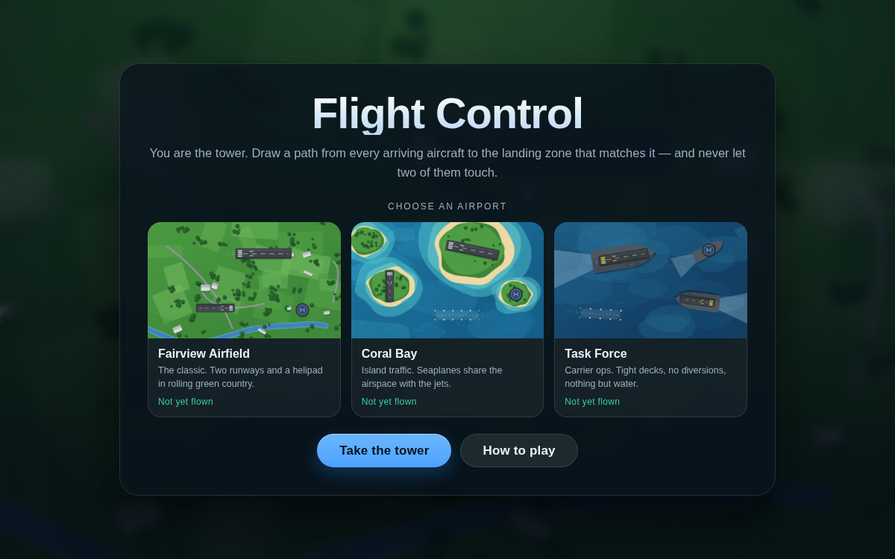
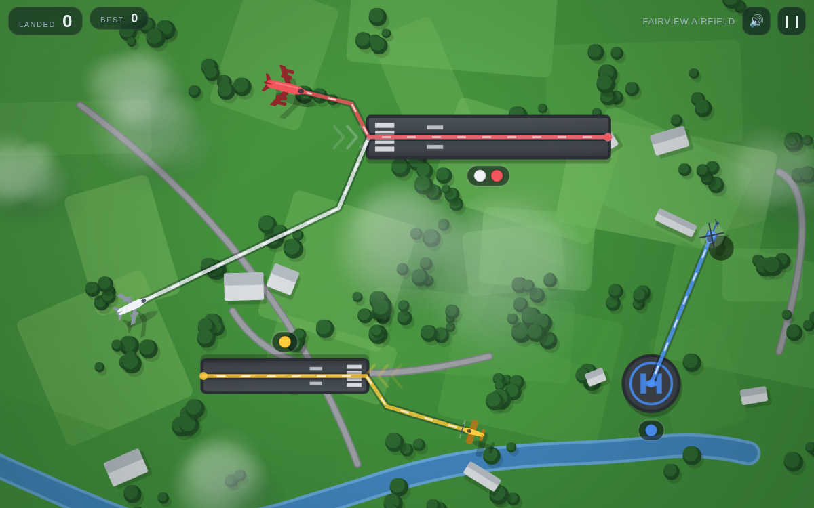
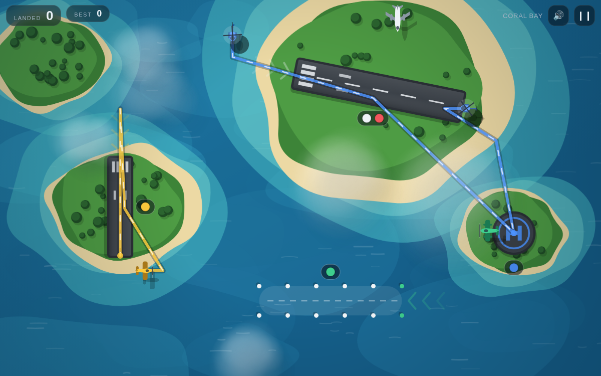
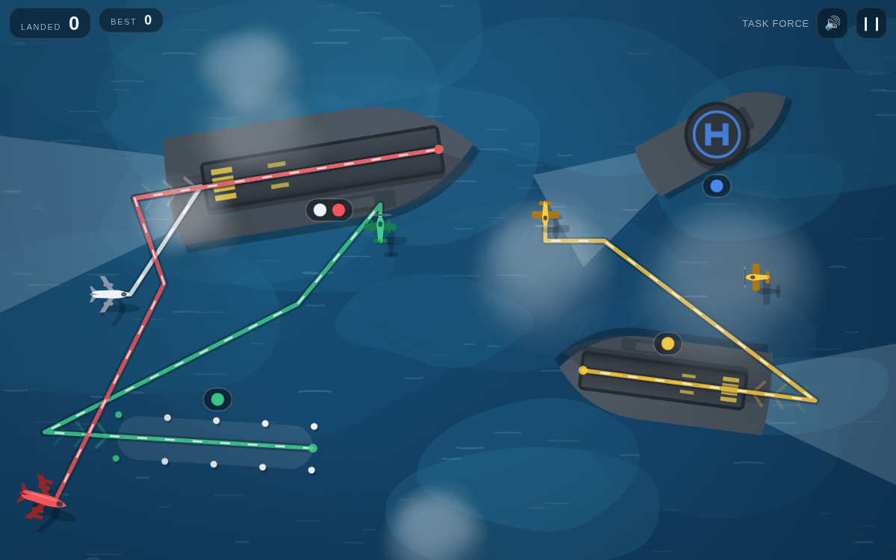

# Flight Control

A browser remake of the line-drawing air traffic control game — the one Firemint
put on the iPhone in 2009. Aircraft arrive from every edge of the screen; you
drag a flight path from each one to the landing zone that matches it, and you
never, ever let two of them touch.

It is one self-contained HTML file. No build step to play it, no dependencies,
no network calls, no tracking. Works with a mouse on a desktop and with fingers
on a phone, and installs as a real app on macOS and iOS.



## Play it

**The quickest way** — open `index.html`. Double-click it in Finder, or drag it
onto a browser window. That is the whole thing; it runs straight off the disk.

**As an app on macOS** — serve the folder and install it:

```sh
npx http-server . -p 8080     # or: python3 -m http.server 8080
```

Open <http://localhost:8080> in Chrome or Edge and use **Install Flight
Control** from the address bar (or ⋮ → Cast, save and share → Install page as
app). It gets its own icon in the Dock and Launchpad, opens in its own window
with no browser chrome, and works offline.

Safari on macOS can do the same with **File → Add to Dock**.

**As an app on iPhone or iPad** — the page has to come from a real URL, so host
the folder anywhere static (GitHub Pages works: push this repo, then Settings →
Pages → deploy from branch). Open the URL in Safari, tap **Share → Add to Home
Screen**. You get a home-screen icon, a fullscreen game with no Safari UI, and
it keeps working with no signal. Turn the phone sideways — the airspace is
wider in landscape.

## How it plays



- **Draw a route.** Press an aircraft and drag a line to its landing zone.
  Release, and it flies exactly the line you drew. Straight lines are fast;
  sharp corners are faster than curves, because a curve is a longer line.
- **Match the badges.** Every landing zone has a badge showing which aircraft it
  takes. Airliners and jumbos share the main runway, light aircraft use the
  short strip, helicopters the helipad, seaplanes the water lane. Drag to the
  wrong zone and the route simply will not stick.
- **Land anywhere on the strip.** Drag onto a runway and the aircraft touches
  down where your line meets it, then rolls out to the end — the same way a
  helicopter simply arrives on the pad. There is no approach corridor to fly out
  to and no lining up from a distance; a strip works from either end, so the
  aircraft always takes the nearer one.
- **Nothing leaves the map.** An aircraft with no route flies straight on and
  turns back when it reaches the boundary. Draw a loop to park one in a holding
  pattern while you deal with something more urgent.
- **Keep them apart.** A red ring means two aircraft are closing on each other.
  If they touch, the shift is over. Jumbos are fastest and turn worst — move the
  jets out of the way and let the slow traffic hold its line.

Arrivals come more often and in greater numbers the longer you last, and new
aircraft types unlock as your score climbs. One point per aircraft landed;
medals at 18, 35, 60 and 100. Best scores are kept per airport, in the browser.

Keyboard: `Esc` or `Space` to pause, `Enter` to start, `R` to fly again.

## The three airports

| | |
|---|---|
| **Fairview Airfield** | The classic. A long runway for the jets, a short strip for light aircraft, a helipad, and a lot of green country in between. |
| **Coral Bay** | Islands. Seaplanes join the mix and land on a marked-out water lane, so there are four separate streams to keep apart. |
| **Task Force** | Carrier operations. Tight decks scattered across open ocean, and nowhere to divert to. |




## Working on it

`index.html` is generated. Edit the files in `src/` and rebuild.

```sh
npm run build     # bundle src/ into the single-file index.html
npm test          # engine unit tests (node --test)
npm run verify    # drive the built game in headless Chromium, write screenshots
npm run check     # all three
npm run icons     # regenerate the app icons
npm run serve     # static server on :8080
```

```
src/engine.js     simulation: aircraft, path following, collisions, spawning,
                  landing geometry, difficulty. Pure logic, no DOM — this is
                  what the unit tests exercise.
src/render.js     canvas rendering: procedural terrain, aircraft silhouettes,
                  flight paths, particles, map thumbnails.
src/audio.js      Web Audio synthesis; there are no sound files.
src/main.js       screens, pointer/touch input, HUD, persistence, game loop.
build.js          inlines the above into index.html.
tools/verify.js   browser checks: plays every map with real pointer input,
                  resizes, pauses, crashes, and runs the whole thing again
                  from a file:// URL.
```

The engine is deterministic given a seed, which is what makes the simulation
testable without a browser: `npm test` plays complete games in Node and asserts
that aircraft land, that routes snap to the correct approach, that unrouted
traffic never escapes the map, and that arrivals are never spawned on top of
existing traffic.

## Credit

The original *Flight Control* was made by Firemint (later Firemonkeys) and
released for iOS in March 2009. This is an independent reimplementation of the
idea written from scratch — none of its code, art or audio is used here.
